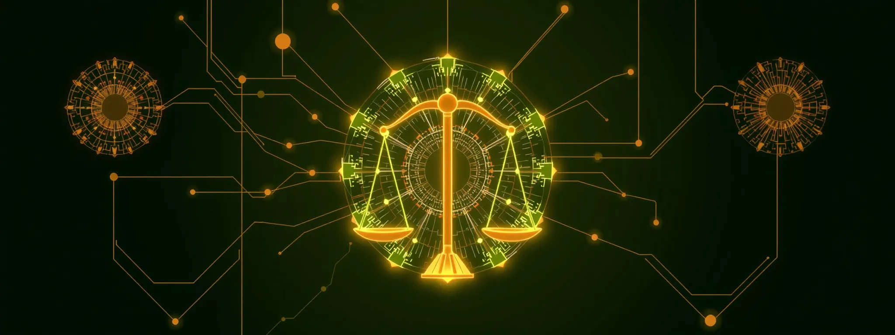

# Awesome Fair Generative AI
This repository contains a list of works on fairness in generative AI, including fairness measurements and bias mitigation methods.

### Table of Contents
- [1. Measuring Fairness in Generative Models](#1.)
  - [1.1. Evaluation Metrics of Image Generation](#1.1.)
